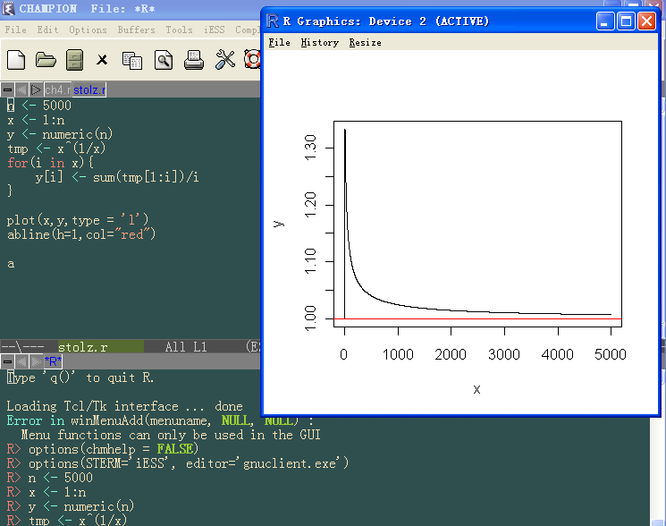

# 漫谈统计分析
### 访问Google

<small> [陈堰平](http://weibo.com/rucypchen) </small>

--- &vertical

## 统计与数据挖掘

--- &vertical

## 常用统计方法

*** 

## 描述统计

--- &vertical

## 数据挖掘

***  

## 数据挖掘的应用

- 精准广告、直效行销（Direct Marketing）
- 银行业：信用卡评分、客户关系管理（CRM）
- 制造业和医疗
- 欺诈行为预测（Fraud Detection）
- ……

***

## 案例一

--- &vertical

## 常用统计工具软件介绍

***

## Excel

[Stop Clicking, Start Typing!](mwfrost.com/r_slides/r_slides.html)

***

## SPSS

*** 

## SAS

***

## R

*** 

## R的IDE：RStudio

*** 

## R的IDE：Emacs+ESS

*** 

## R的IDE：Notepad++ & NppToR

*** 

## 几种软件的比较

*** 

<small><a href="http://www.bjt.name/2012/05/2012-datamining-software/">2012年第13期KDnuggets关于数据挖掘软件的调查</a></small>

--- &vertical 

## 统计学习资源介绍

- [统计之都](http://cos.name)
- [炼数成金](http://www.dataguru.cn)

*** 

## 推荐资料

- 统计学：从数据到结论
- 数据之美
- New Internet：大数据挖掘
- [R菜鸟入门](http://dapengde.com/r4dummies/)
- [《153 分钟学会 R》](http://cran.r-project.org/doc/contrib/Liu-FAQ.pdf) 
- [R参考卡片](http://cran.r-project.org/doc/contrib/Liu-R-refcard.pdf)
- [R语言实战](http://product.dangdang.com/product.aspx?product_id=22928480)
- R语言编程艺术
- [数据挖掘与R语言](http://product.dangdang.com/product.aspx?product_id=23228225)
- ……

---

## 关于统计之都

